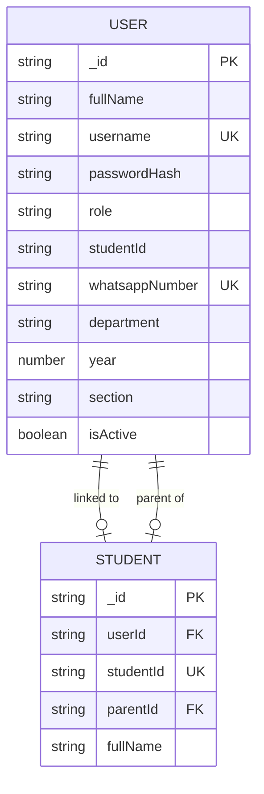
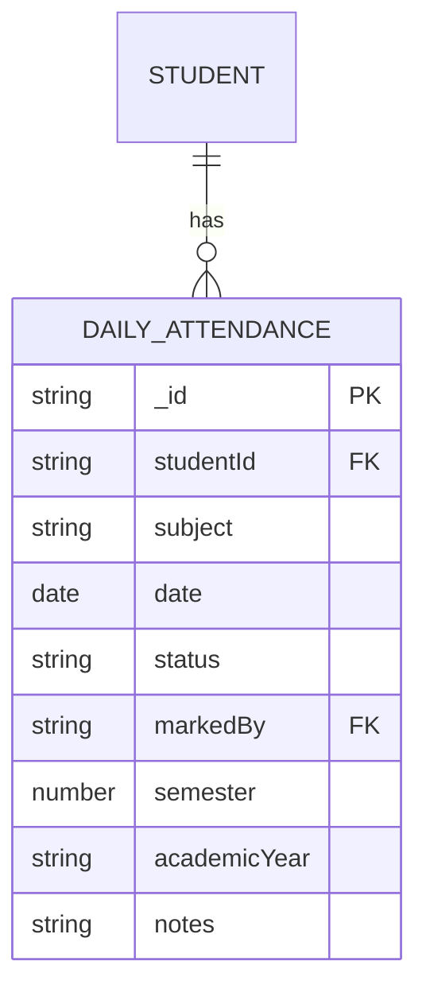
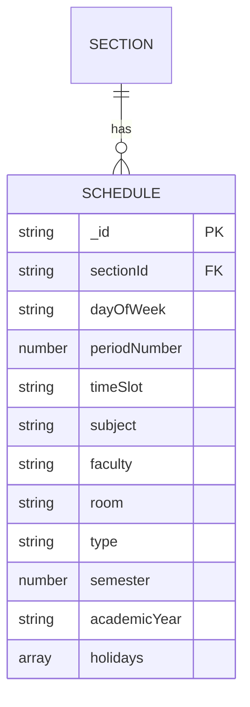
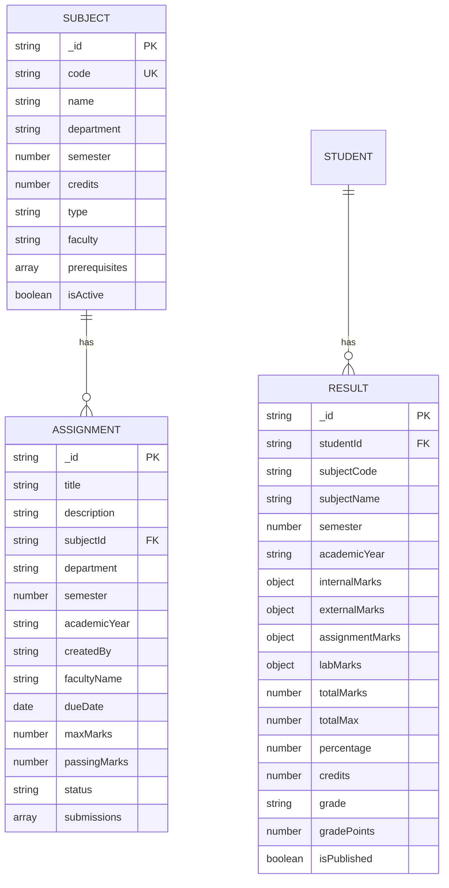
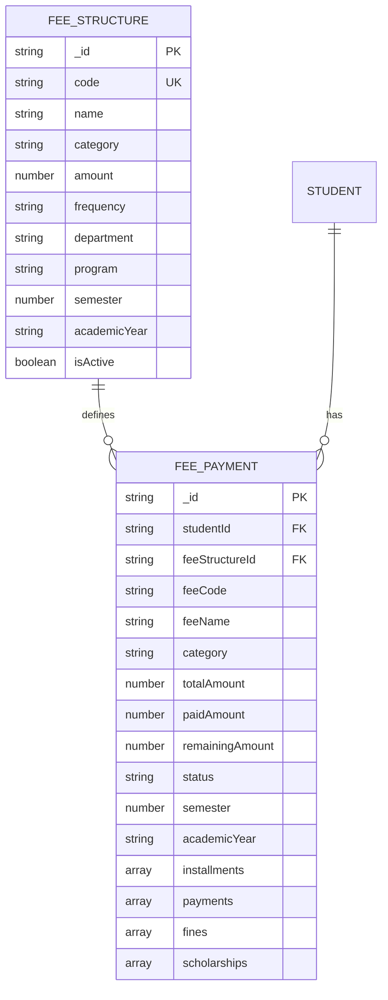
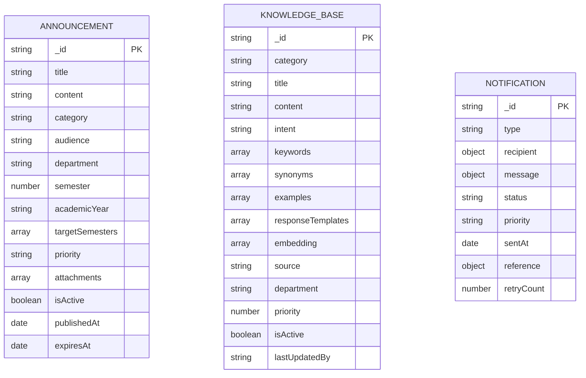
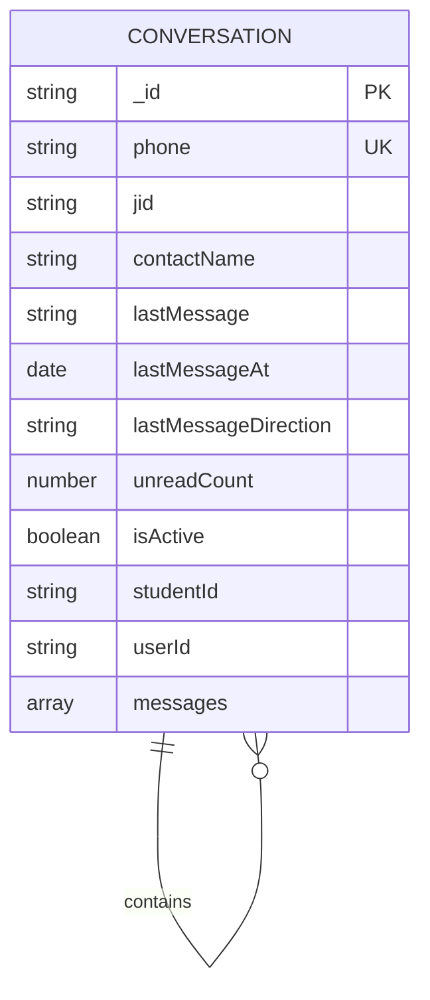
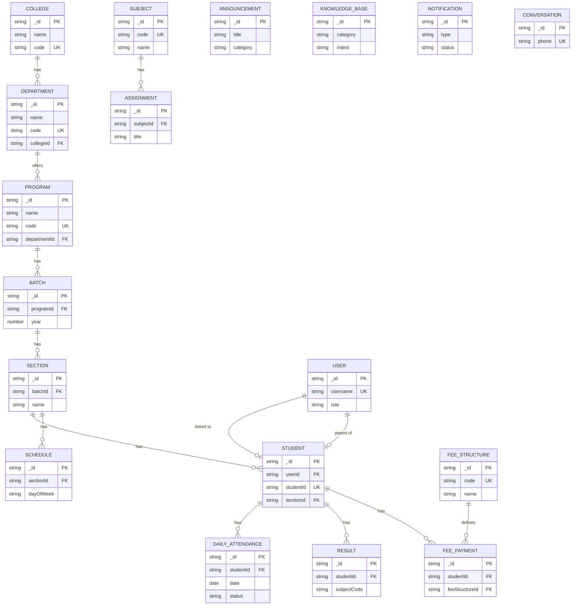

# Entity Relationship Diagram — HITS Database

## Overview

This document contains Mermaid ERD diagrams showing all 18 collections and their relationships.

## Academic Hierarchy ERD

```mermaid
erDiagram
    COLLEGE {
        string _id PK
        string name
        string code UK
        boolean whatsappEnabled
        object address
        object contact
    }
    
    DEPARTMENT {
        string _id PK
        string name
        string code UK
        string collegeId FK
        string hodName
        string email
        boolean isActive
    }
    
    PROGRAM {
        string _id PK
        string name
        string code UK
        string departmentId FK
        string degree
        number durationYears
        boolean isActive
    }
    
    BATCH {
        string _id PK
        string programId FK
        number year
        string name
        number totalStudents
        boolean isActive
    }
    
    SECTION {
        string _id PK
        string batchId FK
        string name
        string advisorName
        number capacity
        boolean isActive
    }
    
    STUDENT {
        string _id PK
        string userId FK
        string studentId UK
        string registerNumber UK
        string sectionId FK
        string fullName
        string email
        string phone
        string department
        string program
        number semester
        string batch
        string section
    }
    
    COLLEGE ||--o{ DEPARTMENT : "has"
    DEPARTMENT ||--o{ PROGRAM : "offers"
    PROGRAM ||--o{ BATCH : "has"
    BATCH ||--o{ SECTION : "has"
    SECTION ||--o{ STUDENT : "has"
```

## User & Auth ERD

## Attendance ERD

## Timetable ERD

## Academics ERD

## Fees ERD

## Communication ERD

## WhatsApp ERD

## Complete ERD (All Relationships)

## Key Relationships Summary

| Relationship | Type | Description |
|-------------|------|-------------|
| College → Department | 1:N | One college has many departments |
| Department → Program | 1:N | One department offers many programs |
| Program → Batch | 1:N | One program has many admission batches |
| Batch → Section | 1:N | One batch has many sections |
| Section → Student | 1:N | One section has many students |
| Section → Schedule | 1:N | One section has many timetable entries |
| User → Student | 1:1 | One user links to one student profile |
| User → Student (parent) | 1:1 | One user can be parent of one student |
| Student → DailyAttendance | 1:N | One student has many attendance records |
| Student → Result | 1:N | One student has many results |
| Student → FeePayment | 1:N | One student has many fee payments |
| Subject → Assignment | 1:N | One subject has many assignments |
| FeeStructure → FeePayment | 1:N | One fee structure defines many payments |
| Conversation → Messages | 1:N | One conversation has many messages (embedded) |
| Assignment → Submissions | 1:N | One assignment has many submissions (embedded) |
| FeePayment → Installments | 1:N | One fee payment has many installments (embedded) |
| FeePayment → Payments | 1:N | One fee payment has many transactions (embedded) |
| FeePayment → Fines | 1:N | One fee payment has many fines (embedded) |
| FeePayment → Scholarships | 1:N | One fee payment has many scholarships (embedded) |
